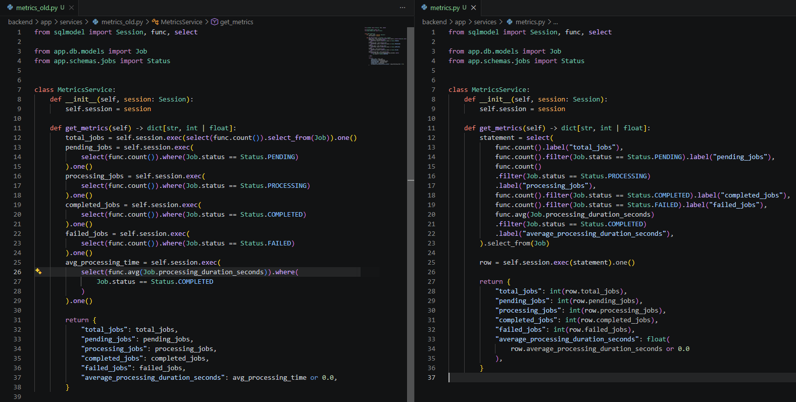

# Architekturentscheidungen
Verwendeter Stack: 
- API: Python, FastAPI mit SQLModel und Pydantic
- Worker: separater Python-Prozess, Ausführung als separater Docker-Container
- Datenbank & Queue: PostgreSQL (Queue über Job-Status und Row-Level-Locking)

> Warum hast du diesen Stack, diese Datenbank, diesen Queue-Mechanismus gewählt? Welche Alternativen hast du erwogen?
Begründung für den API-Stack: 
- Persönliche Kenntnisse in Python und FastAPI am höchsten.
  - außerdem praktische Features wie pydantic Validierung der Request- und Response-Daten und interaktive OpenAPI-Docs

Begründung für den gewählten Queue-Mechanismus: 
- Die Jobs werden ohnehin in der PostgreSQL Datenbank persistiert, in einer zusätzlichen dedizierten Queue würden keine anderen Informationen stehen, man müsste jedoch dafür sorgen, dass die Daten synchron bleiben.
- Man hätte bereits beim Starten der Jobs ein Dual-Write-Problem, da man den Job in der SQL-Datenbank anlegen und einen Eintrag in die Queue schreiben müsste. Stürzt der Prozess ab, nachdem der Job in der Datenbank erstellt wurde, aber bevor der Eintrag in die Queue geschrieben wurde, würde der Job nie von einem Worker verarbeitet werden. Hier könnte das Transactional-Outbox-Pattern Abhilfe schaffen.Ein angeschlossener Broker arbeitet danach jedoch häufig mit einer "at-least-once"-Zustellgarantie, weshalb hier eine weitere Lösung benötigt wird, um eine doppelte Verarbeitung zu vermeiden. Gleichzeitig würde das Pattern auch weitere Komplexität, sowohl im Code, als auch im Datenbankmodell mit sich bringen. 
- Um eingereihte Jobs bei einem Absturz des Queue/Broker-Service nicht zu verlieren, wären weiterer Konfigurationsaufwand hinsichtlich Persistenz oder mehrere Replicas notwendig. 
- Mit einer Single Source of Truth ist ein Job also entweder vollständig in PostgreSQL persistiert und kann verarbeitet werden oder er existiert nicht. Das Problem, dass der Job bei der Ausführung abstürzt und somit in der Datenbank für immer auf "Processing" stehen bleibt, besteht mit dieser Lösung jedoch auch und könnte bspw. durch einen Heartbeat-Mechanismus gelöst werden.
- In den Anforderungen gab es keine explizite Angabe, wie viel Durchsatz das System aushalten soll. Daher würde ich zunächst "klein anfangen" und bei Bedarf anpassen. Das wäre natürlich ein Thema, was in einem echten Projekt vor der Implementierung geklärt werden kann.

Zusammenfassend habe ich mich somit für PostgreSQL als persistente Queue entschieden, da sie alle Anforderungen der Aufgabe erfüllt und gleichzeitig zusätzliche Infrastruktur und damit einhergehende Komplexität vermeidet. 

Bei höheren Anforderungen an Last, Parallelisierung und Skalierung würde ich den Einsatz einer dedizierten Queue bzw. eines Message Brokers und Worker-Frameworks erneut bewerten. Systeme wie Redis oder RabbitMQ in Kombination mit Frameworks wie Celery sind auf verteilte Verarbeitung und hohe Durchsätze ausgelegt und bringen auch weitere Funktionalitäten wie Retries mit, kommen jedoch mit höherer Komplexität und zusätzlichem Infrastrukturaufwand daher.

Ein konkreter Tech-Stack dieser Alternative könnte wie folgt aussehen: 
- FastAPI als Backend
- Redis oder RabbitMQ als Queue bzw. Message Broker 
- Celery oder RQ als asynchrone Worker
- PostgreSQL weiterhin als persistente Datenbank

Persönliche Anmerkung: 
- Ein positiver Nebeneffekt war zusätzlich, dass ich mit dieser Entscheidung Gelegenheit hatte, mich näher mit Locking-Mechanismen zu beschäftigen.

# Startanleitung: 
> Schritt für Schritt, wie man das System lokal zum Laufen bringt.

## Voraussetzungen

- Pflicht:
  - Docker Desktop (inkl. Docker Engine)
  - Docker Compose v2 (bei Docker Desktop in der Regel enthalten)
  - `.env.example` nach `.env` kopieren/umbenennen und in `.env` mindestens folgende Variablen setzen:
    - `POSTGRES_USER=`
    - `POSTGRES_PASSWORD=`
- Optional (nur für lokale Entwicklung/Tests ohne Docker):
  - Python 3.13+
  - uv

## Schnellstart mit Docker

### Typische Befehle (Copy-Paste-Reihenfolge)

1. Basis-Stack starten:

  `docker compose -f docker-compose.yml up -d`
  oder mit 4 Workern
  `docker compose -f docker-compose.yml up -d --scale worker=4`
  
2. E2E-Tests ausführen (stoppt automatisch wieder):

  `docker compose -p e2e_test -f docker-compose.e2e.yml up --abort-on-container-exit --exit-code-from test`

3. Load-Tests mit 500 Job-Requests und 4 Workern ausführen (stoppt automatisch wieder; Anzahl Requests kann in Docker Compose oder Env Variable angepasst werden)):

  `docker compose -p load_test -f docker-compose.load.yml up --abort-on-container-exit --exit-code-from load_test --scale worker=4`

4. Aufräumen (Achtung, löscht auch Datenbank):

  `docker compose -f docker-compose.yml down -v`
  `docker compose -p e2e_test -f docker-compose.e2e.yml down -v`
  `docker compose -p load_test -f docker-compose.load.yml down -v`

Hinweis:
- Für den reinen Docker-Betrieb sind Python und uv nicht erforderlich.
- Lokale Tests ohne Docker (optional): `uv run pytest -q`
- Bei ungueltigen Request-Daten liefert die API HTTP 422 (FastAPI-Standard fuer Validierungsfehler), nicht HTTP 400.

# Designentscheidungen
> Wo hast du bewusst Kompromisse gemacht? 
> Was würdest du in einer Produktionsumgebung anders lösen?

1. Der zentrale Kompromiss hinsichtlich geringerer Komplexität (PostgreSQL als Queue) und Skalierbarkeit (dedizierte Queue / Message Broker) ist oben bereits aufgeführt.

2. Auch den direkten Datenbankzugriff der Worker sehe ich als Kompromiss an 
(Hier habe ich anhand der Formulierung aus der Aufgabe die Annahme getroffen, dass der Worker die Datenbankzugriffe selbst durchführen soll. "Der Worker setzt den Status auf PROCESSING, simuliert die Arbeit (Pause von 2–5 Sekunden) und setzt den Status anschließend auf COMPLETED oder FAILED.").\
Diese Umsetzung kann bei hoher Last und vielen Workern zu einem Bottleneck bei den Verbindungen zur Datenbank führen. Weiter müssen die Worker immer auch das aktuelle Datenbankmodell kennen und Schemaänderungen werden entsprechend komplexer und aufwändiger. Mit einem Message Broker und einem definierten Ergebniskanal könnte hier Abhilfe geschaffen werden. Alternativ könnten die Worker ihren Status per HTTP-Requests an das Backend senden. So würde das Backend wieder zum einzigen Client werden, der mit der Datenbank kommuniziert.

3. Ein weiterer Kompromiss ist die geteilte Codebasis von API und Worker. 
Dadurch können Funktionen und Datenbankmodelle ohne Duplizierung oder Auslagerung in explizite Pakete wiederverwendet werden.
Je mehr verschiedene Worker und je unterschiedlicher die Jobs werden, desto sinnvoller wird es, diese von dem Backend bzw. voneinander zu lösen. Zum einen könnten unnötig große Dockerimages entstehen (reiner Code + Abhängigkeiten). Außerdem könnte es auch Konflikte in Versionen der Abhängigkeiten geben. Geteilte Funktionen könnten dann natürlich dennoch über shared libraries bereitgestellt werden.

4. Das Problem der verwaisten Jobs sollte in der Produktionsumgebung ebenfalls angegangen werden. Eine Option wäre, wie oben bereits erwähnt, die Implementierung eines Heartbeat-Mechanismus. 

5. Aktuell wird die Jobs-Tabelle beim initialen Start der Anwendung aus dem Backend-Code erstellt. In einer Produktivumgebung würde ich entweder eine Lösung für Datenbankmigrationen wie Alembic nutzen oder alternativ entsprechende SQL-Migrationsskripte.

6. Logging, Monitoring und Alerting ausbauen, bspw. mit ELK-Stack oder Prometheus, Loki & Grafana.

7. Neben der Authentifizierung und Autorisierung, die explizit Out of Scope waren, sollten für einen produktiven Einsatz auch weitere Security-Maßnahmen wie zum Beispiel Rate-Limiting genutzt werden, um eine (böswillige oder auch unbeabsichtigte) Überlastung des Systems zu verhindern.  

8. Vor der Produktionsumgebung sollte es auch eine DEV- und QS-Umgebung und entsprechende Deployment und Release-Prozesse geben.

# KI-Einsatz 
> Welche KI-Tools hast du wofür genutzt, und wo hast du generierte Vorschläge angepasst oder verworfen? (Bei keinem Einsatz genügt ein Satz.)
- Die beiden Optionen PostgreSQL + einfacher Worker oder dedizierte Queue + Worker Framework sind mir bereits beim Lesen der Aufgabe in den Sinn gekommen und konnten mithilfe der KI-Tools hinsichtlich verschiedenster Aspekte abgewogen werden.  
- Diese README.md wurde von mir selbst erstellt. Für die Diskussion der Aufgabe und der Architekturentscheidung, zum Abwägen von Vor- und Nachteilen, zur Grammatik- und Rechtschreibkorrektur, sowie für die Unterstützung bei der Implementierung des tatsächlichen Codes habe ich folgende KI-Tools genutzt:
  - ChatGPT und Gemini 
  - GitHub Copilot Pro in VSCode 

- Gerade die typischen CRUD-Operationen konnten mit diesen Tools schnell und effizient implementiert werden. Je nach Modell war das Ergebnis jedoch stark unterschiedlich (Vorschläge kleinerer und älterer Modelle haben zum Beispiel nicht berücksichtigt, welche Funktionen FastAPI und Pydantic bereits zur Typvalidierung und Fehlerbehandlung mitbringen, sodass hier entsprechende Aufmerksamkeit auf die Vermeidung von redundanter Logik gelegt wurde). 
- Besonders bei den Tests habe ich für die Implementierung auch KI genutzt. Ich habe die verschiedenen Testfälle beschrieben und den generierten Code auf Vollständigkeit / Testablauf überprüft. 
- Eine konkrete Implementierung, bei der ich Anpassungen vorgenommen habe, ist die Berechnung der Metriken im MetricsService.
Folgender Screenshot zeigt auf der linken Seite die Funktion, wie sie zuerst generiert wurde. Hier wird für jede einzelne Metrik eine einzelne Select-Abfrage ausgeführt. Dort habe ich Optimierungspotenzial gesehen und die Berechnung der verschiedenen Metriken in eine einzige Abfrage verpackt (siehe rechte Seite) . 
So entstehen weniger Datenbankzugriffe und die Anzahl der Jobs je Status kommen alle aus einem Zugriff, sodass hier keine Inkonsistenzen hinsichtlich der Gesamtzahl der Jobs entstehen sollten.

- Andere Kleinigkeiten, die immer wieder angepasst werden mussten, sind die Verwendung von abgekündigten/veralteten Funktionen oder Schemas. Sei es der "version"-tag in der docker-compose.yml, deprecated pydantic Funktionen wie BaseModel.dict() (ersetzt durch BaseModel.model_dump()) und auch Connection-Strings für die Datenbank wurden in veralteten Varianten generiert (postgres:// -> postgresql://)

# Skalierung
> Wie würdest du das System anpassen, wenn einzelne Jobs 30 Minuten oder länger laufen? Welche neuen Probleme entstehen — etwa bei Worker-Ausfällen oder Deployments? (2–3 Absätze genügen, keine Implementierung nötig.)

- Wenn einzelne Jobs 30 Minuten oder länger laufen, können die entsprechenden Worker in dieser Zeit keine anderen Jobs verarbeiten. Das kann dazu führen, dass die Queue stark anwächst und die Jobs erst nach einer großen Verzögerung durchgeführt werden. \
Als erste/einfachste Maßnahme könnte die Anzahl der Worker und für temporäre Anstiege die Länge / Tiefe der Queue erhöht werden. 

- Wenn vorher absehbar ist, welche Jobs länger brauchen werden (bspw. anhand des Job-Typs oder anderen Merkmalen), wäre es sinnvoll verschiedene Queues für die verschiedenen Typen zu nutzen, damit nicht ein paar lange Jobs tausende kurze Jobs blockieren.  

- Lange Jobs könnten durch Deployments oder Abstürze abgebrochen werden und so in der Datenbank/Queue als "Processing" hängen bleiben, eventuell jedoch eigentlich erfolgreich durchlaufen. Für ungeplante Ausfälle wären Heartbeats sinnvoll, um die verwaisten Jobs nach dem Ausfall wieder erkennen zu können. Für geplante Deployments sollte außerdem ein Graceful Shutdown implementiert werden, sodass ein Worker kontrolliert seinen aktuellen Job beendet und erst dann herunterskaliert wird.

- Um Probleme durch eine doppelte Verarbeitung eines Jobs zu verwmeiden, sollten sowohl Job-Durchführung als auch API-Endpunkte idempotent entwickelt sein, sodass beispielsweise eine erneute Reportgenerierung die Datei unter gleichem Namen mit dem gleichen Inhalt erstellt und überschreibt und so kein Ergebnis verändert. 

- Auch kann es sinnvoll sein, sich Gedanken über eine Dead-Letter-Queue für die Sammlung und spätere Analyse endgültig fehlgeschlagener Jobs zu machen.

# Offene Punkte (falls zutreffend)
> Was hast du bewusst weggelassen, was würdest du als Nächstes angehen — und warum?

Zusätzlich zu den nicht umgesetzten Bonus-Anforderungen und dem Wechsel auf Queue/Message Broker + Worker-Framework bei entsprechendem Bedarf würde ich folgende Punkte noch angehen: 
1. Job-Typen normalisieren
Aktuell wird der Job-Typ als String in der Jobs-Tabelle gespeichert. Durch die Normalisierung in eine eigene Tabelle und die Referenzierung über Keys kann Datenkonsistenz verbessert und Redundanz verringert werden.  
2. Test-Coverage erhöhen
Weitere Tests, wie beispielsweise den automatischen Retry-Mechanismus zu testen, können weitere Funktionalitäten absichern. 
3. Durchsatz-Tests
Aufbauend auf dem Load-Test, könnte ein Test konzipiert und implementiert werden, um herauszufinden, wie viele Jobs mit welcher Anzahl an Workern in einer gegebenen Zeit verarbeitet werden können. So kann auch eine Grundlage geschaffen werden, ab wann ein Wechsel zu Queue/Message Broker + Worker-Framework nötig ist. 
4. Optimierung der Dockerfiles
Hier kann sicher noch etwas optimiert werden, beispielsweise Multi-Stage-Build nutzen, um Image klein zu halten und non-root User für die Ausführung nutzen. 

Nicht umgesetzte Bonus-Anforderungen: 
- Recovery verwaister Jobs
- Idempotenz
- Priorisierung
- Callback/Webhook